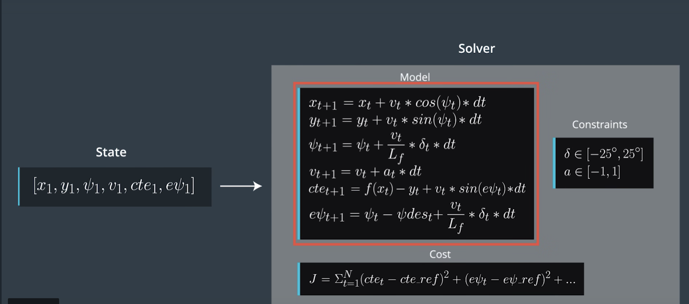
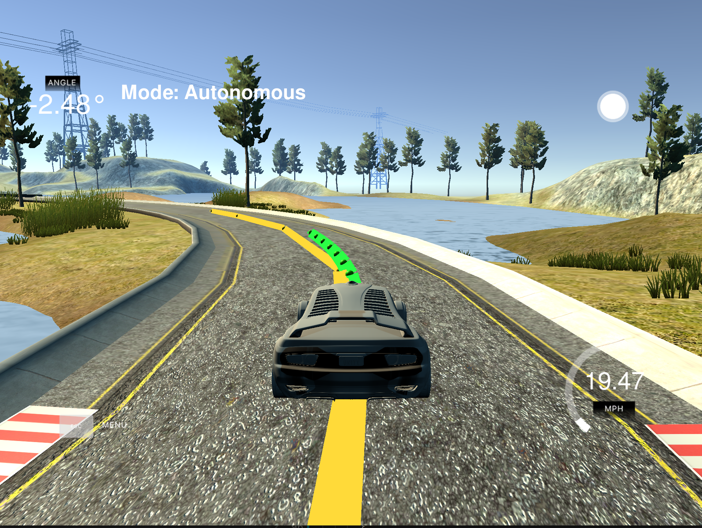

# CarND-Controls-MPC

## Model Predictive Control

MPC essentially is an optimazation problem. Given an intial state, it tries to find a sequence of actuations (steering and acceleration in our case) that minimizes the total cost. 

The state include x, y, psi(bearing), v(velocity), cte(cross track error), epsi(bearing error). The costs in our model includes cte, epsi, delta of steering and acceleration, magnititude of steering and acceleration, velocity error.

The update function can be found in Figure 1.

<p align="center">
  
  <br>
  <em>Figure 1: MPC</em>
</p>

## Timestep Length and Elapsed Duration

I chose `N=20` and `dt=0.1` so that the horization is 2 seconds. dt is chosen as 100 ms because it will be easier to deal with the 100 ms actuation latency. I also tried to chose `N=10` and then the predicted trajectory is much shorter and might not perform well while making a big turn.

## Polynomial Fitting and MPC Preprocessing

All the points received are in global maps coordinate system, they are converted to car coordinate system. It is required to draw reference and predicted trajectory.

```c++
    // Lambda to convert map coordinate system to car coordinate system.
    auto convert_func = [](double car_x, double car_y, double car_psi, double xm, double ym){
    double dx = xm - car_x;
    double dy = ym - car_y;
    double xc = cos(car_psi) * dx + sin(car_psi) * dy;
    double yc = -sin(car_psi) * dx + cos(car_psi) * dy;
    return std::make_pair(xc, yc);
    }; 

    // convert points to car coordinates.
    for(int i = 0; i < ptsx.size(); ++i){
    auto new_point = convert_func(px, py, psi, ptsx[i], ptsy[i]);
    ptsx[i] = new_point.first;
    ptsy[i] = new_point.second;
    }
    px = 0;
    py = 0;
    psi = 0;
```
# Model Predictive Control with Latency

The latency effect is compensated by forcing first actuation to be 0 and our `dt` is set to 100 ms.

```c++
 AD<double> delta0 = 0.0; 
AD<double> a0 = 0.0; 
if(t > 1){
    delta0 = vars[delta_start + t - 1];
    a0 = vars[a_start + t - 1];
}
```

## Result

<p align="center">
  
  <br>
  <em>Figure 2: Result</em>
</p>

